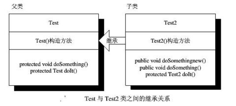
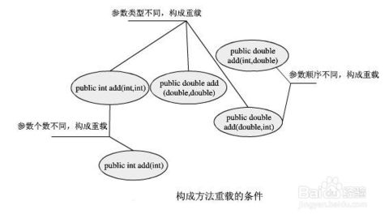

# 继承、多态、接口

## 一、继承

继承，其基本思想是基于某个父类的扩展，制定出一个新的之类，子类可以继承父类的原有的属性和方法，也可以增加原来父类所不具备的属性和方法，或者直接重写父类中的方法。

语法:

        class son extends father{}

## 二、Object类

在开始使用class关键字定义类时，就应用到了继承原理，因为在java中，所有的类都直接或间接继承了java.lang.Object类。Object类是比较特殊的类，它是所有类的父类，是java类层中最高层的类。

所有类都是Object类的子类，所以任何类都可以重写Object类的方法。

1. `getclass()`方法，是Object类定义的方法，它会返回对象执行时的Class实例

        getClass().getname();

2. `toString()`方法的功能是将一个对象返回为字符串形式，它会返回一个string实例

3. `equals`方法比较的是两个对象的实际内容

## 三、使用instenceof操作符判断

当在程序使用向下转型的操作时，如果父类对象不是子类对象的实例，就会发生ClassCastException的错误，所以在执行向下转型之前需要养成一个良好习惯，就是判断父类对象是否为子类对象的实例，这个判断可以使用instenceof操作符来完成。可以使用instenceof判断是否一个类实现了某个接口，也可以用它来判断一个实例对象是否属于一个类。

语法：

        myobject instenceof  ExampleClass

其中`myobject`某类的对象引用；`ExampleClass`某个类返回值为布尔值

## 四、方法的重载

方法的重载就是在同一个类中允许使用一个以上的同名方法，只要这些方法的参数个数或类型不同即可。

## 五、多态

利用多态可以使程序具有良好的扩展性，并可以对所有类对象进行通用处理。

## 六、抽象类和接口

抽象类在解决实际问题时，一般将父类定义为为抽象类，需要使用这个父类进行多态和继承。继承树中越是上方的类越抽象。在多态机制中，并不需要将父类初始化对象，我们需要的只是子类对象，所以在java语言中设置抽象类不可以实例化对像。

语法：

        public abstract classTest{
            abstract void testAbstract();
        }
`abstract`是定义抽象类的关键字

 接口是抽象类的延伸，可以将它看作是纯粹的抽象类，接口中的所有方法都没有方法体.

 接口使用interface关键字进行定义，其语法如下

        public interface 接口名称{
            void drwa();
        }
`public`: 接口可以像类一样被权限修饰符修饰，但`public`关键字仅限于接口在其同名的文件中被定义

一个类实现一个接口可以使用implements关键字。

在java中不允许多重继承，但使用接口就可以多重继承，因为一个类可以同时实现多个接口，这样可以将所有需要继承的接口放置在implements关键字后并用逗号分开。