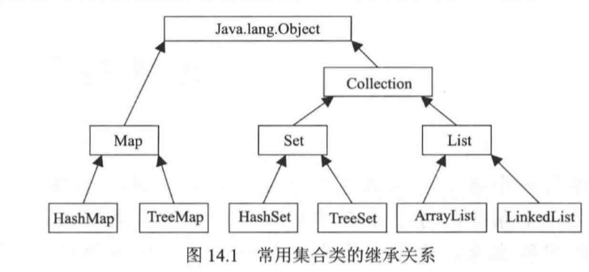
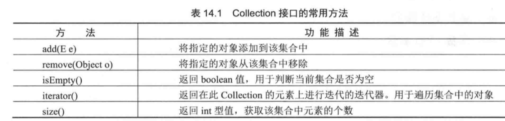

# 集合类

## 一、集合与数组

* 数组（可以存储基本数据类型）是用来存现对象的一种容器，但是数组的长度固定，不适合在对象数量未知的情况下使用。

* 集合（只能存储对象，对象类型可以不一样）的长度可变，可在多数情况下使用。

集合类的继承关系：

* `Collection`接口是集合类的根接口，Java中没有提供这个接口的直接的实现类。但是却让其被继承产生了两个接口，就是`Set`和`List`。`Set`中不能包含重复的元素。`List`是一个有序的集合，可以包含重复的元素，提供了按索引访问的方式。

    

* `Map`是`Java.util`包中的另一个接口，它和`Collection`接口没有关系，是相互独立的，但是都属于集合类的一部分。Map包含了key-value对。Map不能包含重复的key，但是可以包含相同的value。
* `Iterator`，所有的集合类，都实现了`Iterator`接口，这是一个用于遍历集合中元素的接口，主要包含以下三种方法：
    1. `hasNext()`是否还有下一个元素。
    2. `next()`返回下一个元素。
    3. `remove()`删除当前元素。

## 二、3个重要接口

1. `List`里存放的对象是**有序的**，同时也是**可以重复**的，`List`关注的是索引，拥有一系列和索引相关的方法，查询速度快。因为往list集合里插入或删除数据时，会伴随着后面数据的移动，所有插入删除数据速度慢。
2. `Set`里存放的对象是**无序**，**不能重复**的，集合中的对象不按特定的方式排序，只是简单地把对象加入集合中。
3. `Ma`p集合中存储的是键值对，键不能重复，值可以重复。根据键得到值，对`map`集合遍历时先得到键的`set`集合，对`set`集合进行遍历，得到相应的值

## 三、遍历

1. `Iterator`：迭代输出，是使用最多的输出方式。
2. `ListIterator`：是`Iterator`的子接口，专门用于输出`List`中的内容。
3. `foreach`输出：JDK1.5之后提供的新功能，可以输出数组或集合。
4. `for`循环

## 四、排序

* `TreeSet`类可以确保集合元素处于排序状态.
* `TreeSet`集合并不是根据元素的插入顺序进行排序，而是根据元素实际值进行排序。
* `TreeSet`集合采用红黑树的数据结构对元素进行排序

自然排序

`TreeSet`调用集合元素的`compareTo(Object obj)`方法来比较元素之间大小关系，然后将集合元素按升序排列，这就是自然排序。

Java提供了一个`Comparable`接口，该接口里定义了一个`compareTo(Object obj)`方法，该方法返回一个整数，实现该接口的类必须实现该方法，当一个对象调用该方法与另一个对象进行比较时，比如:`obj1.compareTo(obj2)`，如果该方法返回0，则表明两个对象相等，如果返回是一个正整数，则表明obj1大于obj2，如果返回是一个负数，则表明obj1小于obj2。

        class Person implements Comparable<Person>{  //Person类实现了Comparable接口，
            private String name;
            private String noID;
            private int number;
            public Person(String name,String noID){  //构造方法
                this.name=name;
                this.noID=noID;
                this.number=0;
            }
            @Override  //重写compareTo方法
            public int compareTo(Person p) {//java内置的排序对象，可以进行从小到大的排序
                return this.number-p.number;
            }