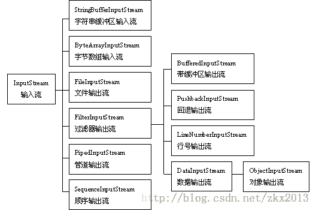

# I/O

## 一、File类的使用

File类只用于表示文件（目录）的信息（名称、大小等），不能用于文件内容的访问

File类基本API

1. 创建功能：`createNewFile(),mkdir(),mkdirs()`
2. 删除功能：`delete()`
3. 重命名功能：`renameTo()`
4. 判断功能：`isFile(),isDirectory(),exists()`等
5. 获取功能：`getName(),getPath(),list()`等
6. 文件过滤器的作用：`list(FilenameFilter filter)`,返回满足指定条件的文件列

## 二、字节流

1. I/O流用来处理设备之间的数据传输

    * InputStream抽象了应用程序读取数据的方式

    

    * OutputStream抽象了应用程序写出数据的方式

    

2. 输入流的基本方式主要是读

        int b = in.read();//读取一个字节无符号填充到int第八位，-1是EOF
        in.read(byte[] buf);//读入多个字节填充的字节数组

3. 输出流的基本方式主要是写

        out.write(int b);
        out.write(byte[] buf);

4. `FileInputStream`具体实现了文件的读取操作

        while((b=in.read())!=-1){读一个文件}
        in.close();//一定要记得关闭流释放系统资源
        批量读取（速度非常快，效率高） vs. 单字节读取（不适合读大文件，效率很低）

5. `FileOutputStream`具体实现了向文件中写数据的操作

注：具体例子看相关练习代码