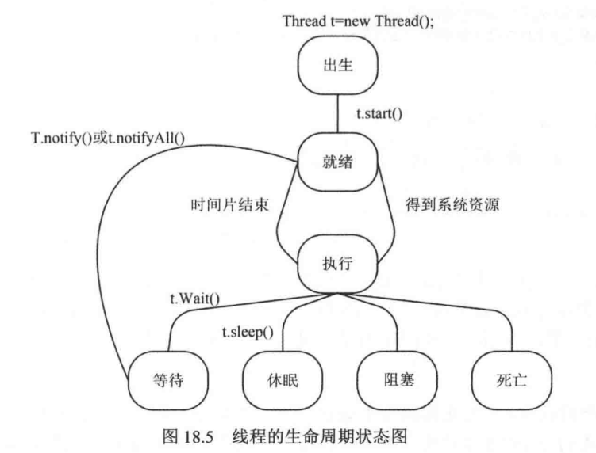

# 多线程

## 一、实现线程的两种方式

1. 继承Thread类

        public class ThreadTest extends Thread{
            public void run(){
                //线程在启动时执行的工作
            }
            public static void main(String[] args){
                new ThreadTest().start(); //启动线程
            }
        }

2. 实现Runnable接口

    使用Runnable接口启动新线程的步骤

    1. 建立Runnable对象
    2. 使用参数为Runnable对象的构造方法创建Thread实例
    3. 调用start()方法启动线程

            class T1 implements Runnable{
                public void run(){ //重写run方法
                    addNum();
                }
            }
            public static void main(String[] args){
                T1 t1 = new T1()
                Thread thread1 = new Thread(t1);
            }

## 二、线程生命周期

## 三、操作线程的方法

1. 线程的休眠

        try{
            Thread.sleep(1000);
        }catch(Exception e){
            e.printStackTrace();
        }

2. 线程的加入

        thread1.join();

3. 线程中断

        thread1.interrupt();

4. 线程的礼让

        thread1.yield();

## 四、线程的优先级

线程的优先级可以使用setPriority()方法调整

## 五、线程同步

解决共有资源访问冲突

### 同步机制

1. 同步块

        synchronized(Obidct){
            //对共享资源的操作
        }

2. 同步方法

        synchronized void f(){
            //对共享资源的操作
        }