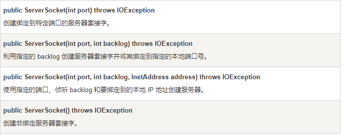
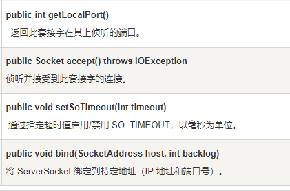
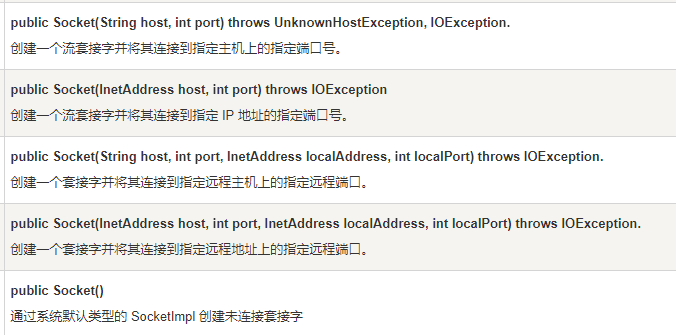
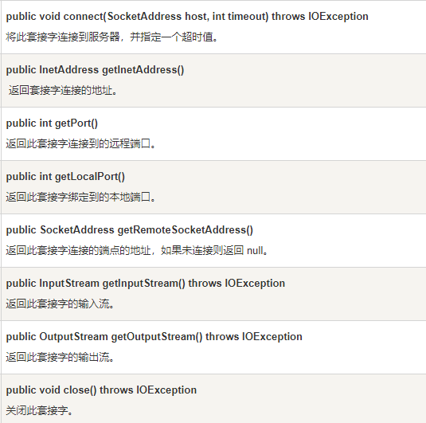
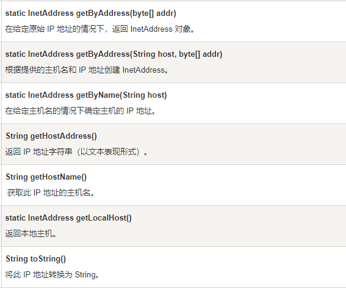

# 网络编程

* TCP：TCP 是传输控制协议的缩写，它保障了两个应用程序之间的可靠通信。通常用于互联网协议，被称 TCP / IP
* UDP：UDP 是用户数据报协议的缩写，一个无连接的协议。提供了应用程序之间要发送的数据的数据包。

## Socket 编程

* 套接字使用TCP提供了两台计算机之间的通信机制。 客户端程序创建一个套接字，并尝试连接服务器的套接字。
* 当连接建立时，服务器会创建一个 Socket 对象。客户端和服务器现在可以通过对 Socket 对象的写入和读取来进行通信。
* `java.net.Socket` 类代表一个套接字，并且 `java.net.ServerSocket` 类为服务器程序提供了一种来监听客户端，并与他们建立连接的机制。
* 连接建立后，通过使用 I/O 流在进行通信，每一个socket都有一个输出流和一个输入流，客户端的输出流连接到服务器端的输入流，而客户端的输入流连接到服务器端的输出流。
* TCP 是一个双向的通信协议，因此数据可以通过两个数据流在同一时间发送.以下是一些类提供的一套完整的有用的方法来实现 socket。

## ServerSocket 类的方法

服务器应用程序通过使用 `java.net.ServerSocket` 类以获取一个端口,并且侦听客户端请求。

ServerSocket 类有四个构造方法：

 ServerSocket 类的常用方法:

 

 ## Socket 类的方法

 java.net.Socket 类代表客户端和服务器都用来互相沟通的套接字。客户端要获取一个 Socket 对象通过实例化 ，而 服务器获得一个 Socket 对象则通过 accept() 方法的返回值。

 Socket 类有五个构造方法:

当 Socket 构造方法返回，并没有简单的实例化了一个 Socket 对象，它实际上会尝试连接到指定的服务器和端口。

下面列出了一些方法，注意客户端和服务器端都有一个 Socket 对象，所以无论客户端还是服务端都能够调用这些方法。

附：InetAddress 类的方法，这个类表示互联网协议(IP)地址

