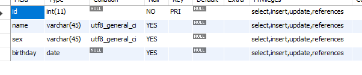

# 数据库

## 数据库连接

首先需要在项目中配置好MySql包

连接代码演示

        import java.sql.Connection;
        import java.sql.DriverManager;
        import java.sql.ResultSet;
        import java.sql.SQLException;
        import java.sql.Statement;

        public class testDB {
            public static void main(String[] args) {
                Connection con;
                String driver="com.mysql.jdbc.Driver";
                String url="jdbc:mysql://localhost:3306/test";
                String user="root";
                String password="xzl953277";
                try {
                    Class.forName(driver);
                    con = DriverManager.getConnection(url, user, password);
                    if (!con.isClosed()) {
                        System.out.println("数据库连接成功");
                    }
                    Statement statement = con.createStatement();
                    String sql = "select * from new_table;";
                    ResultSet resultSet = statement.executeQuery(sql);
                    String name;
                    while (resultSet.next()) {
                        name = resultSet.getString("name");

                        System.out.println("姓名：" + name);
                }
                    resultSet.close();
                    con.close();
                } catch (ClassNotFoundException e) {
                    System.out.println("数据库驱动没有安装");

                } catch (SQLException e) {
                 System.out.println("数据库连接失败");
                }
            }
        }
    
连接上数据库，后面数据库增删查改操作就可以自己去查[API](http://www.runoob.com/mysql/mysql-tutorial.html)手册

## 练习中遇到的问题

1. 解决mysql数据库添加数据时报错:1366

    运行下面这段代码，todo是表名

            ALTER TABLE todo CONVERT TO CHARACTER SET utf8 COLLATE utf8_general_ci

    运行下面代码查看Collation,是否修改为 utf8_general_ci

         SHOW FULL COLUMNS FROM todo

    
2. 解决插入数据时，中文乱码问题

        String url="jdbc:mysql://localhost:3306/test?useUnicode=true&characterEncoding=utf-8";