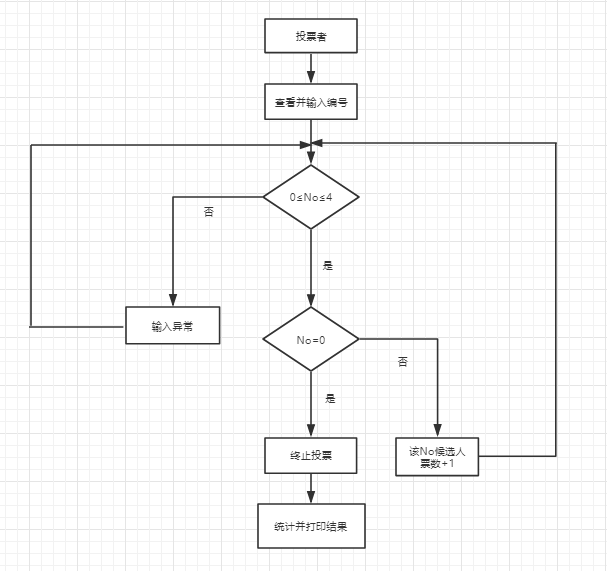

# 投票系统

## 总体介绍

由于本人从事方向为前端，对java了解的不算太多。通过前一阶段java的学习，对java基础有了一个大致的了解。运用书本中的知识，完成了一个简单的投票系统，该系统实现了循环输入、排序、统计、输入异常检测、输入流等基本功能

## 功能描述

1. 程序运行，可以直观的看到候选人姓名及编号
2. 键盘输入候选人编号，进行循环投票。
3. 当输入的数字不在1-4之间，或输入的为字母，则会提示输入不当，接着重新输入
4. 输入0，跳出循环结束投票
5. 根据票数，来进行升序排序
6. 将每人所得票数展示出来，并统计出票数最高者
7. 将当选结果输入到result.txt文本文档中

## 流程图

## 技术点应用说明

1. 输入数据前，显示各候选人信息。[章节6-数组]
2. 循环输入。[章节4-while循环]
3. 输入检测。[章节5-正则表达式、章节8-包装类Integer、章节12-自定义异常]
4. 对结果进行排序。[章节10-接口、章节14-set类中TreeSet类]
5. 将结果输入到指定文本文档中。[章节15-输入流FileOutputStream]